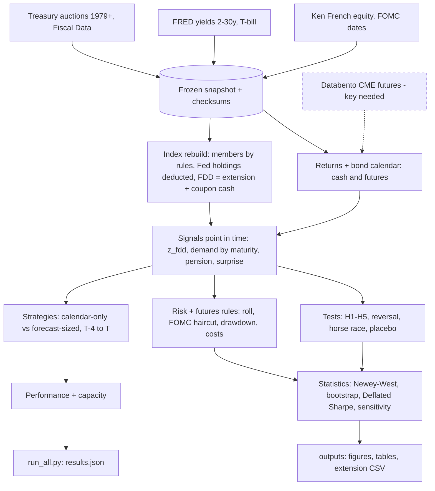
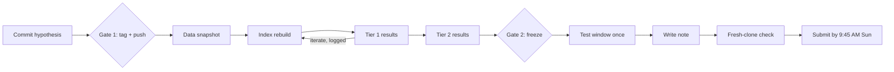

# CLAUDE.md — "The Extension Clock" (Gator Quant Hacks 2026, Systematic Trading track)

You are the coding agent for a 36-hour hackathon research project. Read this whole file before writing code.
Humans make research decisions; you build, test and run. When this file says **STOP**, stop and ask the human.
`AGENTS.md` (for Codex and Cursor) is an identical copy of this file; if you edit one, copy it to the other.

---

## 0. Rules that override everything (break one and the judges cap our score at 4)

1. **Gate 1 (pre-registration).** Do not compute any month-end window return, slope, Sharpe or strategy result until
   the git tag `gate1-prereg` exists. Downloading data, building the calendar, pricing bonds and rebuilding the
   index (which uses only auction records, never returns) are allowed before Gate 1.
2. **Gate 2 (test window).** The test window is **2024-10-01 to 2026-09-30**. No code path may produce a return,
   statistic or plot that uses dates after `IS_END = 2024-09-30` unless HEAD carries the tag `gate2-frozen` and the
   working tree is clean. It runs once. After it runs, no edits to strategy, signals, rules or parameters.
3. **No lookahead.** Every signal for month m uses only data available at the close of the entry day (T−4).
   Standardizations use past months only. Auctions not yet held use the announced amount, never the result.
4. **Reproducible without keys.** `python run_all.py` on a fresh clone rebuilds every headline number from the
   committed public-data snapshot. Databento is needed only for the futures layer (`--futures`); without a key that
   step is skipped with a clear message and the core results are unchanged.
5. **Every number in the note comes from `outputs/results.json`**, written by code. Never hand-type a result.
6. **Never commit** API keys, `.env`, Databento raw data or the Ken French raw file. Public U.S.-government data
   (Fiscal Data auctions, FRED Treasury yields, FOMC dates) goes into `data/snapshot/` with checksums.
7. **Log every variant.** Every in-sample run appends to `runs/trials.csv`. Never delete rows. The Deflated Sharpe uses the count.
8. **Never invent API fields.** Fetch one real response, print its keys, code against what you saw, and note it in a comment.

---

## 1. The project in one paragraph

Bond index funds must hold the Treasury index's duration. The index (Bloomberg US Treasury rules) changes only
at the rebalance on the last business day of the month. It adds new notes and bonds once they are **auctioned**
(settled or not) and drops bonds under 1 year to maturity. It also holds the month's coupon cash and **reinvests it
at the rebalance**. So trackers must buy duration on that day. The month-end Treasury rally is documented
(Hartley & Schwarz, 1990–2018, also in futures). **Our contribution:** rebuild each month's **forced duration
demand** (FDD = index extension + reinvested coupon cash) from public auction records, point in time. Then test
whether a bigger forced purchase means a bigger rally (H1), across months, across the curve (H2) and with a
reversal afterwards (H3). The trade: long 10-year duration from the close 4 bond-market business days before
month-end (T−4) to the month-end close (T), DV01-sized, scaled by the forecast. It's compared with the
calendar-only version (H4).

---

## 2. Deadlines and gates (Eastern Time)

| When | What |
|---|---|
| Sat Oct 3, 12:00 AM | **Gate 1**: `HYPOTHESIS.md` (Appendix A, verbatim) + `config/settings.py` committed; tag `gate1-prereg`; push |
| Sat Oct 3, 1:00 PM | **Tier 1** (submittable): snapshot, calendar, cash returns, index rebuild + validation, H1, both strategies (cash), placebo, required metrics, repo runs |
| Sat Oct 3, 5:00 PM | **Tier 2**: futures layer, H2, H3, H5, risk rules on/off, sensitivity, post-publication, Deflated Sharpe, capacity, figures |
| Sat Oct 3, 8:00 PM | Tier 3 stretch only if Tier 2 is green |
| Sat Oct 3, 9:00 PM | **Gate 2**: fresh-clone check passes; human tags `gate2-frozen`; run `python run_all.py --oos` once |
| Sun Oct 4, 8:00 AM | Second fresh-clone check |
| Sun Oct 4, 9:45 AM | Devpost submitted (hard deadline 10:00). Code pushes accepted until 11:00 (README/typos only) |

---

## 3. What is judged (build for this, nothing else)

Five criteria × 10: Economic Foundation, Innovation, Risk Management, Liquidity & Capital, Performance & Analytical
Evidence (tie-breaker). Performance is **capped at 4** if judges can't run the code, if numbers differ from the note,
or if there's lookahead or tuning on the test window. Required in the note, in-sample and test window separately,
net of costs: annual return, volatility, Sharpe, max drawdown, turnover, equity curve; number of variants tried;
risk section; liquidity/capacity section. Deliverables: quant note PDF (≤ 5 pages) + public GitHub repo with README,
dependency file and one command that reproduces the headline numbers.

---

## 4. Repo layout

```
extension-clock/
├── CLAUDE.md
├── AGENTS.md                    # identical copy for Codex / Cursor
├── README.md                    # setup in 3 commands, the one reproduce command, sources, runtime
├── HYPOTHESIS.md                # Appendix A verbatim; never edited after gate1-prereg
├── requirements.txt             # pinned
├── .env.example                 # DATABENTO_API_KEY=   (optional)   GQH_DEV=1 (team only)
├── .gitignore                   # .env, data/cache/, __pycache__/, .ipynb_checkpoints/
├── config/
│   ├── settings.py              # every parameter (section 6)
│   ├── fomc_dates.csv           # FOMC decision dates 1993–2026 (scraped + hand-checked)
│   └── contract_specs.yaml      # CME tick size, tick value, multiplier per contract, with source URL + date
├── data/
│   ├── snapshot/                # COMMITTED public data: auctions.csv, fred_<SERIES>.csv, mspd_notes_bonds.csv,
│   │                            #   pension_pressure.csv (derived), CHECKSUMS.sha256, VINTAGE.md
│   └── cache/                   # git-ignored: Databento raw, Ken French raw zip
├── src/
│   ├── data/auctions.py  fred.py  french.py  fomc.py  mspd.py  snapshot.py  databento_futures.py
│   ├── calendar.py              # bond-market business days, month-end T, T−k
│   ├── bonds.py                 # price, modified duration, convexity of a coupon bond; curve interpolation
│   ├── returns.py               # daily cash-bond returns per tenor from FRED yields; excess over T-bill
│   ├── index_rebuild.py         # universe by date, amounts, weights, index duration, Ext, coupon cash, FDD, demand by bucket
│   ├── validate.py              # rebuild validation checks
│   ├── signals.py               # z_fdd (+ component z's), w_m, surprise extension, pension pressure, demand map
│   ├── futures.py               # contract selection (roll rule), DV01 from data, futures P&L, costs
│   ├── risk.py                  # sizing, notional cap, FOMC haircut, drawdown rule (each a toggle)
│   ├── backtest.py              # windows, positions, daily NAV, cash and futures versions
│   ├── tests_h.py               # H1–H5, placebo, reversal, horse race, post-publication
│   ├── stats.py                 # Newey-West, bootstrap, Deflated Sharpe, Sharpe-difference test
│   ├── sensitivity.py           # the grid (section 7.12)
│   ├── metrics.py               # required metrics, betas, crowding monitor, tails
│   ├── capacity.py              # volume-based capacity, square-root impact
│   ├── trial_log.py             # runs/trials.csv + gate guards
│   ├── figures.py               # section 8
│   └── report.py                # writes outputs/results.json and tables
├── scripts/
│   ├── download_all.py          # refresh snapshot (FRED, Fiscal Data, MSPD, Ken French), rewrite checksums
│   ├── fetch_fomc.py            # scrape FOMC dates into config/fomc_dates.csv
│   ├── validate_rebuild.py      # prints validation tables and plots for STOP 2
│   └── forecast_next.py         # Tier 3: live forced-demand forecast for the next month-end (7.16)
├── tests/                       # pytest, no network
├── runs/                        # trials.csv, oos_run.log
├── outputs/                     # results.json, figures/, tables/, extension_monthly.csv (open dataset)
└── run_all.py                   # --insample (default) | --futures | --oos | --refresh
```

---

## 5. Environment and commands

- Python 3.11+. Pinned: pandas, numpy, scipy, statsmodels, requests, matplotlib, pyyaml, python-dotenv, pytest,
  beautifulsoup4 (FOMC scrape), databento (optional extra; import lazily inside `databento_futures.py`).
- `GQH_DEV=1` (team `.env` only) turns on the gate guards. Judges won't have it, so their runs are never blocked.

```bash
python -m venv .venv && source .venv/bin/activate && pip install -r requirements.txt
pytest -q                          # no network
python scripts/download_all.py     # only to refresh; normal runs use data/snapshot/
python run_all.py                  # in-sample, cash bonds: every Tier 1/2 number, figures, results.json
python run_all.py --futures        # adds the Databento futures layer (needs DATABENTO_API_KEY)
python run_all.py --oos            # Gate 2 only: test window once (guarded when GQH_DEV=1)
```

---

## 6. `config/settings.py` (single source of every parameter, locked at Gate 1)

```python
IS_START, IS_END   = "1993-01-01", "2024-09-30"   # in-sample (cash bonds)
FUT_START          = "2010-07-01"                 # in-sample futures start (GLBX.MDP3 history begins 2010-06)
POSTPUB_START      = "2019-01-01"                 # post-publication sub-sample, through IS_END
OOS_START, OOS_END = "2024-10-01", "2026-09-30"   # test window: last 2 years (track rule), run once
ZSCORE_MIN_MONTHS  = 36                           # before this, w_m = 1

ENTRY_OFFSET = 4          # enter at close of T-4 (T = last bond-market business day of the month)
EXIT_OFFSET  = 0          # exit at close of T
REVERSAL_DAYS = 3         # H3: first 3 business days of next month
PLACEBO_BDAYS = (4, 7)    # placebo window: enter close of bday 3, exit close of bday 7 (clear of reversal and the 15th)
N_RANDOM_PLACEBO = 1000; SEED = 7; BOOT_N = 10_000; HAC_LAGS = 3

HEADLINE_TENOR = "DGS10"
TENORS = {"1-3y": "DGS2", "3-7y": "DGS5", "7-10y": "DGS10", "10-20y": "DGS20", "20y+": "DGS30"}
CURVE_KNOTS = ["DGS1","DGS2","DGS3","DGS5","DGS7","DGS10","DGS20","DGS30"]   # interpolation, flat beyond ends
RF_SERIES = "DTB3"

# Index rules (Bloomberg US Treasury Index, as summarized for SPTB)
MIN_MATURITY_YEARS = 1.0          # measured at the rebalance date
MIN_PUBLIC_AMOUNT  = 300e6        # after Fed (SOMA) holdings
INCLUSION_RULE = "auctioned_by_rebalance"  # methodology: issued (auctioned) on/before the rebalance date T qualifies, settled or not
                                           # sensitivity: "settled_by_month_end" (issue_date <= last calendar day of month)
REINVEST_COUPONS = True   # FDD includes coupon cash held by the index during the month (sensitivity: False = extension only)
DEDUCT_SOMA = True                # sensitivity: False
EXCLUDE = {"TIPS": True, "FRN": True, "callable": True}

W_CLIP = (0.0, 2.0)               # w_m = clip(1 + z_m, 0, 2)
CAPITAL = 10_000_000
RISK_PER_TRADE = 0.01             # 1-sigma 4-day loss = 1% of capital
VOL_LOOKBACK = 60                 # business days of 10y yield changes, ending T-5
NOTIONAL_CAP = 3.0                # x capital
FOMC_HALF = True                  # risk rule 2
DD_RULE = True; DD_MULT = 2.0     # risk rule 5: drawdown > 2x expected yearly vol -> half size until new high
CASH_COST_BP = 0.5                # yield bp per round trip (cash version)
FUT_COMMISSION_RT = 2.0           # USD per contract round trip; plus 1 tick
COST_STRESS = 2.0
ROLL_BUFFER_BDAYS = 5             # trade contract whose first intention day > exit + 5 bdays
DV01_LOOKBACK = 60
ADV_LOOKBACK = 20; ADV_CAP = 0.05
FUTURES = ["ZT","ZF","ZN","TN","ZB","UB"]; HEADLINE_FUTURE = "ZN"
FUT_YIELD_MAP = {"ZT":"DGS2","ZF":"DGS5","ZN":"DGS10","TN":"DGS10","ZB":"DGS20","UB":"DGS30"}
SEC_UA = None  # not used in this project
```

---

## 7. Module specs

### 7.1 Data (`src/data/`)
- **Auctions** (`auctions.py`): `https://api.fiscaldata.treasury.gov/services/api/fiscal_service/v1/accounting/od/auctions_query`
  with `filter=security_type:in:(Note,Bond)`, `page[size]=10000`, all pages, `sort=auction_date`. Values are
  strings, including the literal `"null"`. Fields confirmed live (Oct 2026): `cusip, security_type, security_term,
  auction_date, issue_date, maturity_date, announcemt_date, offering_amt, total_accepted, int_rate, high_yield,
  reopening, original_issue_date, soma_accepted, soma_holdings, inflation_index_security, floating_rate, callable,
  currently_outstanding, closing_time_comp`. Coverage starts 1979.
  **Before using `soma_accepted`:** check on 5 auctions with SOMA add-ons whether `total_accepted` includes them
  (≈ offering + SOMA) or not (≈ offering). Write the finding in a comment and set the public amount accordingly.
- **FRED** (`fred.py`): keyless CSV `https://fred.stlouisfed.org/graph/fredgraph.csv?id=<SERIES>` for
  DGS1, DGS2, DGS3, DGS5, DGS7, DGS10, DGS20, DGS30, DTB3. Missing values may be `.` or blank. Known gaps: DGS20
  1987-01 to 1993-09; DGS30 2002-02 to 2006-02. Handle explicitly; never forward-fill across a gap longer than 5 days.
- **MSPD** (`mspd.py`, validation only): Fiscal Data Monthly Statement of the Public Debt summary table (e.g.
  `/v1/debt/mspd/mspd_table_1`). Inspect fields first, then extract marketable notes and bonds outstanding by month.
- **Ken French** (`french.py`): `https://mba.tuck.dartmouth.edu/pages/faculty/ken.french/ftp/F-F_Research_Data_Factors_daily_CSV.zip`.
  Daily Mkt-RF and RF in percent; header and footer lines to skip. Raw file stays in `data/cache/`; only the derived
  `pension_pressure.csv` goes into the snapshot.
- **FOMC** (`fomc.py` + `scripts/fetch_fomc.py`): decision dates (last day of each meeting, including unscheduled)
  from `federalreserve.gov/monetarypolicy/fomccalendars.htm` and `fomchistorical<YEAR>.htm`. Save
  `config/fomc_dates.csv`, then hand-check 10 dates and record that in VINTAGE.md.
- **Snapshot** (`snapshot.py`): write CSVs plus `CHECKSUMS.sha256` plus `VINTAGE.md` (download timestamps, row counts).
  `run_all.py` verifies checksums and stops with a clear message on a mismatch.
- **Databento** (`databento_futures.py`, optional): `GLBX.MDP3`, all outrights via `symbols="ZN.FUT"`,
  `stype_in="parent"`; drop spreads (symbols with "-"). Daily settlement from the `statistics` schema
  (`databento.StatType.SETTLEMENT_PRICE`; use the enum, not a number), volume from `ohlcv-1d`. Call
  `client.metadata.get_cost(...)` first and print it; abort above a configurable budget. Verify the trade-date
  alignment of `ts_event` against 3 known settlement dates. Raw data → `data/cache/`; commit only derived
  per-trade summaries.

### 7.2 `calendar.py`
Bond business days = dates with a non-missing DGS10. `month_end(m)` = last such day in the month (T).
`offset(T, -k)` moves k business days back. Unit-test: a month ending on a weekend, and Columbus Day (bond market closed).

### 7.3 `bonds.py`
Semiannual coupon bond: `price(coupon, ytm, years)`, `mod_duration(...)`, `convexity(...)`. Years = days/365.25;
periods = ceil(2 × years); first period fractional is acceptable (state it). `curve_yield(date, years)` interpolates
linearly across `CURVE_KNOTS` available that day (flat beyond the ends).

### 7.4 `returns.py`
Daily return of a constant-maturity par bond per tenor: buy at t−1 a bond with coupon = y(t−1) and maturity = tenor;
value it at y(t) with maturity tenor − Δt. Return = price/100 − 1 + coupon × Δt (Δt = calendar days / 365). Excess
= return − DTB3 × Δt. Validate on one tenor: annual returns should broadly track a published Treasury total-return
index; compare against futures returns from 2010 when available (correlation reported).

### 7.5 `index_rebuild.py`
For each month m with rebalance date T (last business day) and entry date E = T−4:
- **Securities:** one row per CUSIP; tranches = original issue + reopenings. Exclude TIPS
  (`inflation_index_security == "Yes"`), FRNs (`floating_rate == "Yes"`), callable (`callable == "Yes"`), bills/CMBs.
- **Amount** of a CUSIP as of rebalance date d = Σ public amounts of tranches with `auction_date ≤ d` (base rule;
  under the "settled_by_month_end" sensitivity use `issue_date ≤` the last calendar day of the month). Tranches whose
  `auction_date > E` use `offering_amt`; skip them if `announcemt_date > E` and count them.
- **NOW universe** (members during month m): the NEXT universe of the previous rebalance (T of month m−1).
- **NEXT universe** (members after this rebalance at T): per `INCLUSION_RULE`, every tranche with
  `auction_date ≤ T` counts (settled or not); maturity − (first day of month m+1) ≥ 1 year; amount ≥ $300M.
  Amounts include all tranches auctioned by T.
- **Pricing:** coupon = `int_rate`. For a new CUSIP not yet auctioned at E, coupon = `curve_yield(E, maturity)`.
  Price and duration on the curve at E for both universes (same curve, so only membership and amounts change).
- **Coupon cash** `c_m`: coupons paid during month m by NOW members (semiannual, on the maturity-day schedule:
  usually the 15th or month-end; coupon = int_rate / 2 × public amount), divided by NOW market value. No principal
  arises inside the index, because bonds leave it at 1 year to maturity.
- **Forced duration demand:** `FDD_m = Ext_m + c_m × D_next` (years of index duration trackers must add at T).
  With `REINVEST_COUPONS = False`, FDD = Ext (a sensitivity).
- **Outputs per month:** `D_now, D_next, Ext, c_m, FDD`, MV totals, counts of adds/removes, and **demand by bucket**
  `ΔC_b = Σ_{i∈next∩b} w_i D_i − Σ_{i∈now∩b} w_i D_i` (Σ_b ΔC_b = Ext), plus the cash term spread by NEXT weights,
  with buckets by remaining maturity 1–3, 3–7, 7–10, 10–20, 20+ years.
- Write `outputs/extension_monthly.csv` (the open dataset: date, Ext, c_m, FDD, bucket demands).

### 7.6 `validate.py` (runs before any return analysis; **STOP 2** shows its output to humans)
1. Rebuilt total par (notes + bonds, before SOMA deduction) vs MSPD marketable notes + bonds by month: report the
   gap; expect a small, explainable gap, larger before ~2000 because pre-1979 issues are missing.
2. Rebuilt index duration over 2015–2024 vs published Treasury-index ETF durations (humans look up and cite current values).
3. Histograms and time series of Ext, c_m and FDD; flag |z| > 4 months and trace each to its auctions.
4. Counts per month of adds, removes and skipped-for-lookahead tranches.

### 7.7 `signals.py`
- `z_m = (FDD_m − mean(FDD_{<m})) / std(FDD_{<m})`, expanding window, needs ≥ `ZSCORE_MIN_MONTHS`; else NaN → w = 1.
  Also compute the same z for each component (Ext only, cash only) for the component test.
- `w_m = clip(1 + z_m, 0, 2)`.
- `surprise_m = Ext_m − mean(Ext for the same calendar month over the prior 3 years)` (Tier 3).
- `pension_m` = equity cumulative return (Ken French Mkt-RF + RF) from the first business day of month m to T−5, minus the
  10-year cash-bond return over the same days; z-scored on past months.
- Dummies: quarter-end, year-end, refunding month (Feb, May, Aug, Nov), FOMC-in-window.

### 7.8 `risk.py`
- `sigma_bp` = std of daily 10-year yield changes (bp) over the 60 days ending T−5.
- `DV01_target = RISK_PER_TRADE × CAPITAL / (sigma_bp × sqrt(4))` (dollars per bp), × `w_m` (forecast-sized) or × 1 (calendar-only).
- Rule 2: × 0.5 if an FOMC decision date is in (E, T]. Rule 5: drawdown rule on the strategy's own NAV, computed
  only from past days. Notional cap: 3× capital. Each rule has an on/off toggle; the note reports both.

### 7.9 `futures.py`
- **Contract selection (roll rule):** first intention day (FID) of a quarterly contract = 2 business days before the
  first business day of its delivery month (March, June, September, December). At entry E, choose the
  highest-volume outright whose FID > exit + `ROLL_BUFFER_BDAYS`. Hold that one contract from E to T. Unit-test:
  February, May, August and November month-ends pick the next quarterly contract.
- **DV01 per contract** = slope of the regression of daily settlement change (in $ per contract = Δprice ×
  multiplier) on −Δyield (bp) of the mapped FRED tenor over the past 60 days.
- Contracts = round(DV01_target / DV01_contract); 0 → no trade, counted.
- P&L = contracts × Δsettlement × multiplier − contracts × (tick value + commission) per round trip (× stress).
  Futures P&L is already an excess return; idle capital earns DTB3 for total-return NAV.

### 7.10 `backtest.py`
Daily NAV over the window. Cash version: position notional = DV01_target / (D_tenor × 1e-4) in the tenor's par bond,
held from the close of E to the close of T. Cost = `CASH_COST_BP` × DV01 per round trip. Futures version per 7.9.
Strategies: `calendar_only`, `forecast_sized` (headline), `curve_allocated` (H2 trade: DV01 split across buckets
in proportion to max(ΔC_b, 0); cash version). All daily returns are in % of capital.

### 7.11 `tests_h.py` and `stats.py`
- **H1:** OLS of `R_m` (10-year window excess return, %) on `z_m` (forced duration demand), Newey-West (3 lags):
  b, 95% CI, t, n. Also tercile means of `R_m` by `z_m` with bootstrap CIs. Same in yield terms (−Δy bp).
  **Component test:** `R_m` on z(Ext) and z(cash) together; both coefficients are predicted > 0.
- **H2:** panel of buckets × months: −Δy_b over the window on standardized ΔC_b, with **month fixed effects**
  (cross-sectional only), standard errors clustered by month. Prediction: coefficient > 0.
- **H3:** excess return over the first 3 business days of month m+1, regressed on `z_m`. Prediction: < 0.
  Also the average cumulative path from T−10 to T+5 by tercile (figure).
- **H4:** net Sharpe(forecast_sized) − Sharpe(calendar_only), paired bootstrap by month (10,000, seed 7), for
  in-sample, post-publication and the test window (sign only).
- **H5:** `R_m` on z_fdd, z_pension, quarter-end, year-end, refunding-month and FOMC dummies (Newey-West).
- **Placebo:** the window on business days 4–7 (enter close of business day 3, exit close of business day 7), clear
  of the month-start reversal and of coupon dates on the 15th. Same tests, including the FDD relation (predicted
  none). Also 1,000 random 4-day windows per month that avoid T−4…T+3 and the 15th ± 1 (seeded): distribution of
  mean returns vs the month-end mean.
- **Post-publication:** every H1/H4 number again on 2019-01 to 2024-09.
- **Deflated Sharpe** (Bailey & López de Prado): N = rows in `runs/trials.csv`; variance of trial Sharpes from
  the log; skew and kurtosis from the strategy's returns.

### 7.12 `sensitivity.py`
Grid: entry T−2 … T−6 × exit {T, T+1} × tenor {5y, 10y, 30y} × `INCLUSION_RULE` {auctioned, settled} ×
`REINVEST_COUPONS` {True, False} × `DEDUCT_SOMA` {True, False} × cost {1×, 2×}. Each cell: H1 slope and net Sharpe (forecast vs calendar) with n.
Write `outputs/tables/sensitivity.csv` plus a markdown version with the headline cell marked. Reported in full.

### 7.13 `metrics.py` and `capacity.py`
- **Required metrics** per strategy × {in-sample, post-publication, test window} × {cash, futures}: annual return
  (geometric), volatility (daily × √252), Sharpe (excess of DTB3), max drawdown, turnover (Σ|notional traded| /
  average capital / years), hit rate, worst window, plus the equity curve.
- **Betas:** daily strategy excess returns on buy-and-hold 10-year excess returns and equity excess returns → alpha, betas.
- **Crowding monitor:** by year, the share of the T−10…T cumulative return earned before E.
- **Tails:** worst 5 windows with dates and simple causes (bigger yield move, FOMC in window, etc.).
- **Capacity:** ADV over 20 days per contract; trade capped at 5% of ADV; impact per side ≈ σ_daily_price ×
  √(contracts / ADV) × contracts × multiplier (stated as rough). Net Sharpe vs capital on a log grid from $10M to
  $10B; report the capital where net Sharpe halves.

### 7.14 `trial_log.py` and guards
- `log_trial(cfg, window, results)` appends: `timestamp_utc, git_commit, dirty, config_hash, window, strategy,
  tenor, entry, exit, n, H1_b, H1_lo, H1_hi, sharpe_fc, sharpe_cal, note`. Called by every in-sample run.
- With `GQH_DEV=1`: `assert_gate1()` requires the `gate1-prereg` tag before any return analysis. `assert_gate2()`
  requires HEAD tagged `gate2-frozen` and a clean tree before any date > `IS_END`. `--oos` writes
  `runs/oos_run.log` and refuses a second run unless `--force-rerun`, which appends a "FORCED RERUN" line that must
  be disclosed in the note.
- All loaders accept `end=IS_END` by default; in-sample code paths physically filter to `date <= IS_END`.

### 7.15 TIPS-index replication (Tier 3, highest-value stretch)
Same code, second index: the Bloomberg US TIPS index (TIPS only: `inflation_index_security == "Yes"`, ≥ 1 year,
same month-end rebalance and cash rule). Real-yield curve from FRED DFII5, DFII7, DFII10, DFII20, DFII30 (daily from
2003). Window returns of the 10-year TIPS par bond at the real yield (inflation accrual ignored: state it). Run H1 with
the TIPS FDD only, in-sample 2003-01 to 2024-09. TIPS have a different issuance calendar, so a positive slope here
is an independent replication of the mechanism. Reported as evidence, not as a second trade.

### 7.16 Live forecast (Tier 3)
`scripts/forecast_next.py`: compute FDD, z and w for the next month-end (Oct 30, 2026) using only auctions announced
as of the run date (later auctions counted as unknown and listed). Write `outputs/live_forecast.json` with the run
timestamp and git commit. This is a public, checkable prediction. It never feeds back into any result.

---

## 8. Outputs

`outputs/results.json` (every number the note quotes):
```json
{
  "meta": {"commit": "", "generated_utc": "", "snapshot_checksums_ok": true, "settings_hash": ""},
  "validation": {"par_gap_by_decade": {}, "duration_recent": {}, "extension_stats": {}, "skipped_tranches": 0},
  "in_sample": {
    "H1": {"b": null, "ci": [null, null], "t": null, "n": 0, "terciles": {}, "components": {"ext": {}, "cash": {}}},
    "tips_replication": {},
    "H2": {"coef": null, "ci": [null, null], "n_obs": 0},
    "H3": {"coef": null, "ci": [null, null]},
    "H4": {"sharpe_fc": null, "sharpe_cal": null, "diff": null, "ci": [null, null]},
    "H5": {}, "placebo": {}, "random_windows": {},
    "metrics": {"cash": {"forecast_sized": {}, "calendar_only": {}, "curve_allocated": {}}, "futures": {}},
    "risk_rules_on_off": {}, "betas": {}, "crowding": {}, "tails": [], "capacity": {}, "deflated_sharpe": {}
  },
  "post_publication": {"H1": {}, "H4": {}, "metrics": {}},
  "oos": {"ran_utc": null, "commit": null, "H1": {}, "H4": {}, "metrics": {}},
  "trials": {"count": 0}
}
```
Figures (`outputs/figures/`, 300 dpi, readable in greyscale; every caption states the takeaway in one sentence):
1. `event_path.png` (**page-1 hero exhibit**): average cumulative excess return T−10 → T+5 by forced-demand tercile,
   with 95% bands. It shows the run-up and the reversal in one picture.
2. `terciles.png`: mean window excess return by forced-demand tercile, 95% CI.
3. `extension_series.png`: monthly extension, refunding months marked.
4. `curve_map.png`: H2, window yield change vs predicted demand by bucket.
5. `equity_curve.png`: forecast-sized vs calendar-only, cash and futures; test window shaded.
6. `capacity.png`: net Sharpe vs capital.

---

## 9. Tests and definition of done

`pytest -q` (no network):
- `test_bonds.py`: par bond prices at 100; duration matches a known textbook value; convexity is positive.
- `test_calendar.py`: weekend month-end; Columbus Day closure; T−4 across a holiday.
- `test_index_rebuild.py`: on a fixture of 6 auctions, adding a 30-year bond raises D; a bond crossing 1 year is removed;
  a tranche auctioned after E uses `offering_amt`; TIPS and FRNs excluded; a bond auctioned on T but settling next
  month is included; coupon cash for a fixture month equals the hand-computed value; FDD = Ext + c × D_next.
- `test_signals.py`: z uses only past months (changing a future Ext leaves z_m unchanged); w clipping.
- `test_futures.py`: February, May, August and November month-ends select the next quarterly contract; DV01
  regression on synthetic data recovers the true slope.
- `test_stats.py`: Newey-West matches statsmodels; Deflated Sharpe on a known example; seeded bootstrap is deterministic.
- `test_guards.py`: with `GQH_DEV=1`, OOS dates are refused without the tag.

Done means:
- [ ] Fresh clone with no keys: `pip install -r requirements.txt && python run_all.py` reproduces `outputs/results.json`
      (identical except timestamps) in under 10 minutes.
- [ ] With `DATABENTO_API_KEY`: `python run_all.py --futures` adds the futures blocks.
- [ ] Checksums verified; no secrets (`git grep -nE "API_KEY=.+"` finds only `.env.example`).
- [ ] README: a results table at the very top (headline slope, net Sharpe forecast-sized vs calendar-only, in-sample
      and test window, trial count), then 3 setup commands, the reproduce command, every source cited, runtime, the
      open dataset described. Judges at comparable events read the code line by line.
- [ ] Every rule in code has a docstring naming its source (index methodology, CME spec, the brief, or "our choice, pre-registered").
- [ ] The random-window placebo is labelled "luck test" in outputs and figures.
- [ ] `runs/trials.csv` row count equals `results.json["trials"]["count"]`.

---

## 10. Build order with STOP points

| Phase | Clock | You do | STOP |
|---|---|---|---|
| 0 | Fri 11:20 PM–12:00 AM | Scaffold the repo; `settings.py`; `HYPOTHESIS.md` from Appendix A; `.gitignore`; pinned requirements | **STOP 1**: humans review, commit, tag `gate1-prereg`, push |
| 1 | Sat 12:00–2:30 AM | Downloaders, snapshot + checksums, calendar, `bonds.py`, `returns.py`, auction loader, tests | none |
| 2 | Sat 8–11 AM | `index_rebuild.py`, `validate.py`, `extension_monthly.csv` | **STOP 2**: humans review the validation output; fallback signal if it fails |
| 3 | Sat 9 AM–1 PM | signals, risk, cash backtest, H1, H4 (in-sample), placebo, required metrics, `results.json` v1 | Tier 1 check, push |
| 4 | Sat 10 AM–1 PM (parallel) | Databento layer: cost check, pulls, roll rule, DV01, futures P&L | none |
| 5 | Sat 1–5 PM | H2, H3, H5, risk on/off, sensitivity, post-publication, Deflated Sharpe, capacity, figures | Tier 2 check, push |
| 6 | Sat 5–8 PM | Tier 3 only if green, in this order: **TIPS-index replication** (7.15), live forecast (7.16), surprise extension, NY Fed SOMA by CUSIP, 1-minute month-end profile | humans decide |
| 7 | Sat 8–9 PM | Fresh-clone check in a temp dir; fix only reproducibility bugs | **STOP 3**: humans tag `gate2-frozen`; you run `python run_all.py --oos` once |
| 8 | Sat 9 PM → | Tables for the note from `results.json`; README; nothing that changes logic | Sun 8 AM second fresh-clone check |

**Fallback signal** (if STOP 2 fails): Ext_m ≈ Σ over tranches issued in month m of (amount × duration) /
total index MV − Σ over removals of (amount × duration) / total MV. Logged as a variant, disclosed in the note.

---

## 11. Never do these

- Touch dates after 2024-09-30 before `gate2-frozen`, including in plots, notebooks or "quick checks".
- Re-run the test window to fix a result, or change anything after it.
- Use `total_accepted` for an auction held after the entry day.
- Standardize with full-sample means.
- Report only the best cell of a grid.
- Add machine learning, dashboards, live trading or extra sponsor APIs to the core path. (Winners at comparable
  events used simple, debuggable models; our model is one linear slope and one sizing rule.)
- Commit keys, Databento raw data or the Ken French raw file.
- Type any number into the note or README that isn't in `results.json`.

---

## 12. Diagrams





---

## Appendix A: `HYPOTHESIS.md` (write verbatim at Phase 0)

```markdown
# Hypothesis (committed before any backtest)

Edge source: structural constraint + liquidity provision.

We expect US Treasury notes and bonds to rise in price over the last four trading days of the month, by more when
the forced duration demand is larger, because index-tracking bond funds must buy duration at month-end, when the
Treasury index adds new issues and reinvests the month's coupon cash. The edge persists because the index rules are
fixed and trackers are judged on matching the index, not on when they trade. If true, returns should scale with the
predicted forced demand and partly reverse in the first days of the next month. It fails if the size of the forced
demand does not matter, or the gain does not reverse.

Forced duration demand: FDD_m = Ext_m + c_m × D_next, where Ext_m is the jump in index duration at the rebalance
(new issues auctioned by the rebalance date added, bonds under 1 year removed) and c_m is the month's coupon cash
as a share of index value.

Headline numbers (fixed in advance):
1. Dose-response slope b in R_m = a + b z_m + e_m (10-year window excess return on the standardized forced
   duration demand, Newey-West 95% interval). Prediction: b > 0, and both components point the same way.
2. Net Sharpe of forecast-sized (w_m = clip(1 + z_m, 0, 2)) vs calendar-only, in-sample (1993-01 to 2024-09) and
   test window (2024-10 to 2026-09).

Predictions: H1 b > 0; H2 maturity buckets receiving more predicted buying see larger yield falls; H3 partial
reversal in the first 3 business days of the next month, larger after months of heavy forced demand; H4 forecast-sized beats
calendar-only in-sample, after publication (2019-01 to 2024-09) and in sign in the test window; H5 pension pressure
adds a little, quarter-end adds nothing beyond forced demand. Placebo: windows on business days 4–7 show neither
the gain nor the relation. Stretch: the same slope appears in the TIPS index, which has a different issuance calendar.

Power note: with a true Sharpe near 1, 24 test-window months give t ≈ 1.4; the test window can confirm the sign,
not significance.

Kill conditions: b ≤ 0 or centered on zero; no reversal; forecast-sized ≤ calendar-only; effect only in the 1990s;
vanishes at 2× costs.

Known prior evidence (not our contribution): Hartley & Schwarz document the base month-end effect for 1990–2018.
```

## Appendix B: glossary (plain words)
- **Extension**: how much the index's average duration jumps at the month-end rebalance when new bonds are added and old ones drop out.
- **Forced duration demand (FDD)**: extension plus the duration trackers add by reinvesting the month's coupon cash, which the index holds until the rebalance.
- **T, T−4**: the last bond-market business day of the month, and the day 4 business days earlier.
- **DV01**: dollars gained or lost per 1 basis point move in yield.
- **First intention day**: the first day a futures seller can announce delivery; big holders roll before it.
- **Placebo**: the same test on a window where no index event happens; it should show nothing.
- **Deflated Sharpe**: a Sharpe ratio adjusted for how many variants were tried.
